# StegDetect

<p align="center">
  
</p>

**StegDetect** is a Bash-based steganography and suspicious text triage tool for images, text files, audio files, and folders. It wraps common forensics utilities, collects raw and decoded text, and highlights likely hidden content such as encoded strings, metadata clues, embedded files, QR payloads, whitespace stego, shell commands, URLs, IP addresses, and other suspicious indicators.

It is useful for CTFs, malware triage, incident-response image checks, and general steganography investigation.

> StegDetect reports findings only. It does not execute extracted or decoded payloads.

## Features

- Scans single files or whole directories.
- Supports image, text, and audio file discovery.
- Image extensions: PNG, BMP, JPG, JPEG, GIF, WebP, TIFF, and TIF.
- Text extensions: TXT, MD, LOG, CSV, JSON, XML, YAML, HTML, CSS, JS, and SH.
- Audio extensions: WAV, AU, MP3, FLAC, OGG, OPUS, M4A, AAC, AIF, and AIFF.
- Runs available steganography and forensics tools automatically.
- Saves a terminal-style report for every scanned file.
- Scans QR codes and other barcode payloads when `zbarimg` is installed.
- Scans whitespace steganography in text files when `stegsnow` is installed.
- Captures audio metadata and generates spectrogram images when `mediainfo` and `sox` are installed.
- Detects hidden printable text from raw bytes and scanner output.
- Attempts safe Base64, hex, and ROT13 decoding.
- Flags suspicious indicators such as:
  - shell execution terms like `powershell`, `cmd.exe`, `/bin/sh`, and `bash -c`
  - downloader or remote-execution tools like `curl`, `wget`, `certutil`, and `bitsadmin`
  - code execution terms like `eval`, `exec`, `system`, and `base64 -d`
  - URLs, domains, IP addresses, and email addresses
  - high-entropy or gibberish-looking strings
  - brace-delimited hidden text like `NAME{...}`
- Includes `--deep` mode for exhaustive `zsteg -a` checks.
- Includes `--install` mode so the command can be called from any directory.

## Quick Start

```bash
# after cloning this repository
cd stegdetect
chmod +x stegdetect.sh
./stegdetect.sh image.png
```

Scan a directory:

```bash
./stegdetect.sh samples/
```

Write reports to a dedicated folder:

```bash
./stegdetect.sh --output reports image.png
```

Run a deeper PNG/BMP scan:

```bash
./stegdetect.sh --deep image.png
```

## Installation

### Root Install

Install StegDetect as a system command:

```bash
cd stegdetect
sudo ./stegdetect.sh --install
```

After that, run it from any directory:

```bash
stegdetect image.png
stegdetect --help
```

By default this installs to:

```text
/usr/local/bin/stegdetect
```

### User Install

If you do not want to install as root, install it into a user-owned directory that is already on your `PATH`:

```bash
./stegdetect.sh --install --install-dir "$HOME/.local/bin" --command-name stegdetect
```

If `$HOME/.local/bin` is not on your `PATH`, add this to your shell config:

```bash
export PATH="$HOME/.local/bin:$PATH"
```

Then reload your shell and verify:

```bash
stegdetect --version
```

## Dependencies

StegDetect runs with whatever tools are installed and skips missing checks. The core experience works best with:

| Tool | Purpose | Typical package |
| --- | --- | --- |
| `file` | Basic file type detection | `file` |
| `strings` | Raw printable text extraction | `binutils` |
| `python3` | Suspicious text analysis and safe decoding | `python3` |
| `exiftool` | Metadata, comments, C2PA, EXIF fields | `libimage-exiftool-perl` |
| `zbarimg` | QR code and barcode payload scanning | `zbar-tools` |
| `stegsnow` | Whitespace steganography scan for text files | `stegsnow` |
| `mediainfo` | Audio metadata extraction | `mediainfo` |
| `sox` | Audio spectrogram generation | `sox` |
| `zsteg` | PNG/BMP LSB checks | Ruby gem `zsteg` |
| `binwalk` | Embedded file and signature scan | `binwalk` |
| `steghide` | Steghide metadata probe | `steghide` |
| `jsteg` | JPEG JSteg extraction attempt | upstream binary |
| `stegdetect` | JPEG steganography detector | source build |

On Debian or Ubuntu-based systems:

```bash
sudo apt update
sudo apt install -y file binutils python3 libimage-exiftool-perl zbar-tools stegsnow mediainfo sox binwalk steghide ruby wget
sudo gem install zsteg
```

When dependencies are missing, StegDetect can prompt to install known tools:

```bash
./stegdetect.sh image.png
```

To skip dependency prompts:

```bash
./stegdetect.sh --no-install image.png
```

To auto-confirm dependency prompts:

```bash
./stegdetect.sh -y image.png
```

## Usage

```text
Usage:
  stegdetect.sh [OPTIONS] <file-or-directory>
  stegdetect.sh --install
```

| Option | Description |
| --- | --- |
| `-h`, `--help` | Show the manual. |
| `--version` | Show the current version. |
| `--install` | Install this script as a callable command. |
| `--install-dir DIR` | Choose the install directory. Default: `/usr/local/bin`. |
| `--command-name NAME` | Choose the installed command name. Default: `stegdetect`. |
| `--output DIR` | Save reports into `DIR`. Default: current directory. |
| `--flag-pattern REGEX` | Add or replace the custom pattern used for raw and decoded text search. |
| `--no-decode` | Disable Base64, hex, and ROT13 decode attempts. |
| `--deep` | Run exhaustive checks such as `zsteg -a`. Useful but noisier. |
| `--no-install` | Do not prompt to install missing scanner tools. |
| `-y`, `--yes` | Answer yes to dependency install prompts. |

## Examples

Scan one image:

```bash
stegdetect image.png
```

Scan a text file for whitespace stego and suspicious strings:

```bash
stegdetect notes.txt
```

Scan an audio file and generate a spectrogram:

```bash
stegdetect song.wav
```

Scan all supported files in a folder:

```bash
stegdetect ./evidence
```

Use a custom pattern:

```bash
stegdetect --flag-pattern 'secret\{[^}]+\}' image.png
```

Disable safe decode attempts:

```bash
stegdetect --no-decode image.png
```

Run a deeper, noisier scan:

```bash
stegdetect --deep image.png
```

Save reports outside the current directory:

```bash
stegdetect --output ./reports ./evidence
```

## Report Output

Each file gets a report named:

```text
stegdetect_report_<filename>.txt
```

Audio scans can also create spectrogram images named:

```text
stegdetect_spectrogram_<filename>.png
```

The report contains sections such as:

- `file(1)` for basic file identification.
- `strings` for raw printable text samples.
- `exiftool` for metadata, comments, and provenance fields.
- `mediainfo` for audio metadata.
- `stegsnow whitespace scan` for whitespace-hidden text in text files.
- `QR code scan` for QR code and barcode payloads through `zbarimg`.
- `stegdetect JPEG scanner` for JPEG-specific steganography indicators.
- `zsteg` for PNG/BMP least-significant-bit findings.
- `jsteg reveal` for JPEG JSteg payload attempts.
- `binwalk` for embedded signatures and appended data.
- `sox spectrogram` for visual inspection of hidden audio messages.
- `steghide info` for steghide carrier checks.
- `custom pattern grep` for user-provided regex matches.
- `suspicious text analysis` for encoded, obfuscated, or malicious-looking strings.

Severity labels:

| Severity | Meaning |
| --- | --- |
| `high` | Strong indicator, such as shell execution text or brace-delimited hidden payload text. |
| `suspicious` | Worth review, such as readable decoded text, URLs, IPs, high-entropy strings, or hex blobs. |
| `info` | Contextual finding, such as an email address or invalid custom regex warning. |

## Safety Model

StegDetect is designed for triage:

- It does not execute decoded strings.
- It does not run extracted payloads.
- It only prints decoded previews when they look readable.
- It skips tools that are not installed.
- It stores temporary extraction data in a temporary directory and removes it after each scan.

Treat all decoded or extracted content as untrusted.

## Root Tool Notes

Installing this project as `stegdetect` can share a name with the older JPEG-only `stegdetect` scanner. This wrapper avoids calling itself recursively. If the JPEG scanner is installed separately, the wrapper looks for an external scanner command or `stegdetect-bin`.

When this script builds the JPEG scanner from source, it installs that scanner as:

```text
/usr/local/bin/stegdetect-bin
```

That keeps the wrapper command available as:

```text
/usr/local/bin/stegdetect
```

## Development

Run the CLI test harness:

```bash
bash tests/test_stegdetect_cli.sh
```

Run a shell syntax check:

```bash
bash -n stegdetect.sh
```

Run against the included sample image without dependency prompts:

```bash
./stegdetect.sh --no-install --output /tmp/stegdetect-reports image.png
```

## Project Layout

```text
.
+-- README.md
+-- assets/
|   `-- stegdetect-demo.svg
+-- image.png
+-- stegdetect.sh
`-- tests/
    `-- test_stegdetect_cli.sh
```

## Legal Notice

Use StegDetect only on files you own or are authorized to investigate. The tool is intended for education, defensive analysis, incident response, and legitimate forensic work.

## License

MIT License. See [LICENSE](LICENSE).
